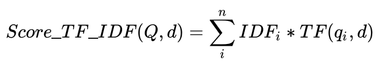
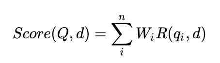
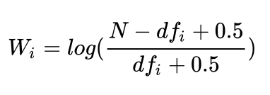
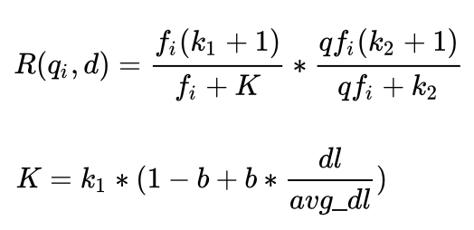

# TF-IDF
一个用户问题与一个文档的TF-IDF相似度，是将用户问题中每一词与文档计算得到的TF-IDF值求和。


BM25的计算方法和TF-IDF类似。

# BM25
Reimplement BM25 with python3
### BM25公式：


其中，Q为用户问题，d为“文档”库中的一个文档，n为用户问题中词的个数，q_i为用户问题中第i个词，W_i为该词的权重，R(q_i,d)为该词与标准问题的相关性分数。W_i相当于TF-IDF算法中的IDF，R(q_i,d)相当于是TF-IDF算法中的TF；只不过BM25对这两个指标进行了优化，具体如下：




其中，N表示为“文档”库中的总文档数， df_i 表示包含词汇 q_i 的标准问题的个数。其实这里的W_i也就是相当于TF-IDF中的IDF，一个词如果被越多的文档包含，说明这个词的重要性越低，就像‘的’，‘了’这种词几乎每篇文章都会有，但是在文档相似度方面又没有很高的贡献。


### 单词与文档的相关性
BM25的设计依据一个重要的发现：词频和相关性之间的关系是非线性的，也就是说，每个词对于文档的相关性分数不会超过一个特定的阈值，当词出现的次数达到一个阈值后，其影响就不再线性增加了，而这个阈值会跟文档本身有关。因此，在刻画单词与文档相似性时，BM25是这样设计的：



其中，k_1,k_2和b是调协因子，一般分别设为2，1，0.75； f_i 表示词汇 q_i在文档中出现的次数； qf_i 表示词汇在用户问题中出现的次数；dl 为文档的长度； avg_dl 为“文档”库中所有文档的平均长度。

其中，变量k_1是一个正的参数，用来标准化文章词频的范围，当k_1=0，就是一个二元模型（binary model）（没有词频），一个更大的值对应使用更原始的词频信息。b是另一个可调参数（0<b<1），他是用决定使用文档长度来表示信息量的范围：当b为1，是完全使用文档长度来权衡词的权重，当b为0表示不使用文档长度。


### 单词与query的相关性
当query很长时，我们还需要刻画单词与query的之间的权重。对于短的query，这一项不是必须的。这里qf_i表示单词i在query中的词频，k_2是一个可调正参数，来矫正query中的词频范围。

### 运行
```
python main.py
```

outputs:

| Query_id | Document_id |  rank_id | BM25_value |
|------|------|------|------|
|0	|3127	|0	|17.168630281724607|
|0	|2246	|1	|13.074544882177358|
|0	|1930	|2	|10.894128792490445|
|1	|2748	|0	|13.796923352177505|
|1	|2897	|1	|13.25847752540956|
|1	|2491	|2	|12.964882702322535|

